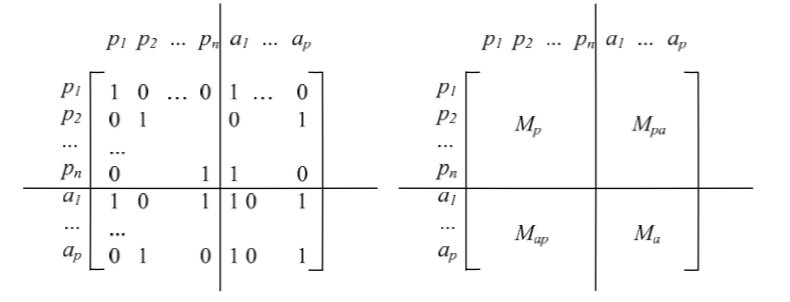
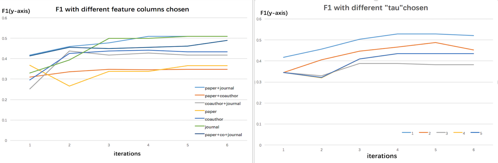
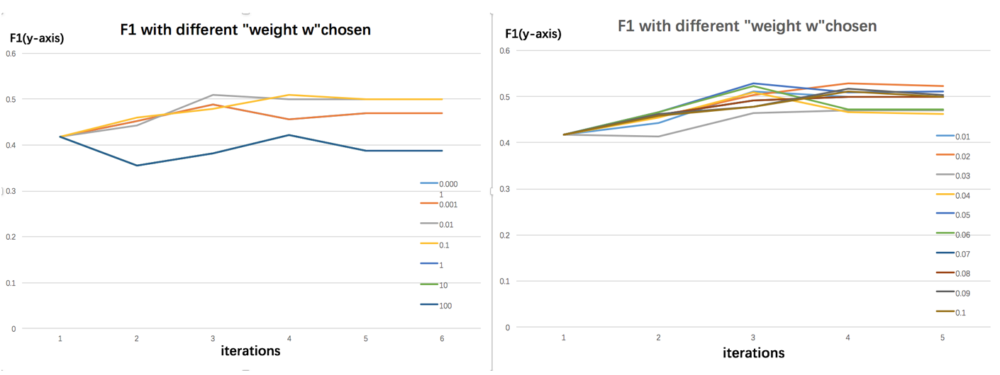
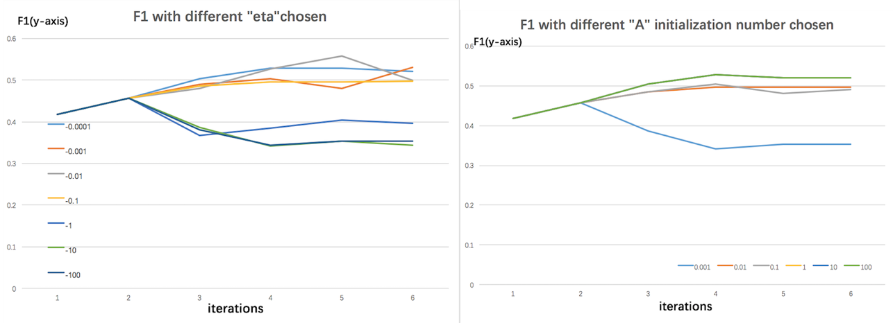

Here is the report of the implement of two different algorithms to deal with name disambiguation in author citations,separately used Spectral clustering (paper 3) & EM algorithm with C6 tau-coauthor constraints (paper 6).

## Step 0: Load the packages, specify directories

```{r}
if (!require("pacman")) install.packages("pacman")
if (!require("nnet")) install.packages("nnet")
if (!require("nnet")) install.packages("stringr")
if (!require("plyr")) install.packages("plyr")
if (!require("text2vec")) install.packages("text2vec")
if (!require("ggplot2")) install.packages("ggplot2")
pacman::p_load(text2vec, dplyr, qlcMatrix, kernlab, knitr)
library(nnet)
library(stringr)
library(plyr)
library(text2vec)
library(ggplot2)
setwd("~/Spr2017-proj4-team10-master")
```

## Step 1: Load and process the data

For the data given, there are some information we want to extract and store them in a regular form: canonical author id, coauthors, paper title, publication venue title. 

Following the TA's instruction, We read in the records and use regular expressions to replace the punctuations and special symbols. We also split original records to create new variables we need and delete NA rows by writing R function `read_citation()` in `read_citation.R`.

```{r read and preprocess data,eval=F}
source('../lib/read_citation.R')
data.lib="../data/nameset"
file_names=list.files(path=data.lib, "*.txt")
Data = list()
for(i in 1:length(file_names)){
  Data[[i]] <- read_citation(file_names[i])
  Data[[i]] <- na.omit(Data[[i]])
}
names(Data) = file_names
```

Notice: We saved the data we processed in a Rdata list containing canonical author id, coauthors, paper title, journal title as `text.Rdata`,so we can directly use them while knit pdf without running the above chunk. While our project is evaluated,feel free to check by let `eval=T`.

```{r}
load("../output/text.RData")
```


## Step 2: Feature design

Basically,We want to use $Papertitles$, $Coauthor$ and $Journaltitle$  to design features for citations(For paper 6,we also consider these three features' combination like $Papertitles+Coauthor$,$Papertitles+Journaltitle$,$Journaltitle+Coauthor$). As the notation used in the paper, we want to find a $m$-dimensional citation vector $\alpha_i$ for each citation $i$, $i=1,...,n$. In this dataset, $n$ is the row number of the dataset. 

We study "TF-IDF" (term frequency-inverse document frequency) and NTF (the normalized "TF") as suggested in the paper,which is intended to reflect how important a word is to a document in a collection or corpus,they are defined as the following. 

$freq(i,d)$ in the last equation refers to the term frequency of feature $i$ in a citation $d$. $max(freq(i,d))$ refers to the maximal term frequency of feature $i$ in any citation $d$.

$$
\begin{aligned}
\mbox{TF}(t) &=\frac{\mbox{Number of times term $t$ appears in a document}}{\mbox{Total number of terms in the document}}\\
\mbox{IDF}(t) &=\log{\frac{\mbox{Total number of documents}}{\mbox{Number of documents with term $t$ in it}}}
\end{aligned}
$$

$$TF-IDF(t)=TF(t)*IDF(t)$$
$$ntf(i,d)=freq(i,d) * max(freq(i,d))$$
To compute TF-IDF, we first need to construct a document-term matrix (DTM). In other words, the first step is to vectorize text by creating a map from words to a vector space. Here, we can apply function `vocabulary_Paper`, `vocabulary_Journal` and `vocabulary_Coauthor` to choose different variables in the Dataset we have in `create_dtm.R`.We also remove pre-defined stopwords, the words like a, the, in, I, you, on, etc, which do not provide much useful information and create a DTM. we apply fit_transform function for tfidf DTM and directly compute ntf DTM.


```{r}
source('../lib/create_dtm.R')

cluster_citation<-function(file){
#vectorize paper tities & create dtm

dtm_paper <- vocabulary_Coauthor(file)

# create tfidf matrix
dtm_tfidf <- as.matrix(fit_transform(dtm_paper, tfidf))
tfidf<-as.matrix(dtm_tfidf)

#create ntf matrix
dtm_tf<-apply(dtm_paper,1,function(term) term/sum(term))
ntf<-as.matrix(apply(dtm_tf,1,function(term) term/max(term)))

#apply spectral cluster function
source('../lib/myspectralCluster.R')
#apply function myspectral cluster
set.seed(2)
cluster_tfidf <- myspectralCluster(as.matrix(tfidf), 
                       centers=length(unique(file$AuthorID)))
cluster_ntf <- myspectralCluster(as.matrix(ntf), 
                       centers=length(unique(file$AuthorID)))
return(list(c_tfidf=cluster_tfidf$myData, c_ntf=cluster_ntf$myData))
}
```


## Step 3: Clustering

## method 1: spectral clustering (paper 3)

The third part of cluster_citation function above is the spectral cluster executation. Following suggestion in the paper, we carry out spectral clustering on the Gram matrix of the citation vectors sourcing the cluster_citation function in lib. The number of clusters is assumed known as stated in the paper. Following instructions in section 3.1, we calculated 3 variable


```{r apply_spec_cluster,eval=F}
Start_time<-Sys.time()
tfidf <- TfIdf$new()
freqs_AGupta<-cluster_citation(Data$AGupta.txt)
freqs_AKumar<-cluster_citation(Data$AKumar.txt)
freqs_CChen<-cluster_citation(Data$CChen.txt)
freqs_DJohnson<-cluster_citation(Data$DJohnson.txt)
freqs_JLee<-cluster_citation(Data$JLee.txt)
freqs_JMartin<-cluster_citation(Data$JMartin.txt)
freqs_JRobinson<-cluster_citation(Data$JRobinson.txt)
freqs_JSmith<-cluster_citation(Data$JSmith.txt)
freqs_JTanaka<-cluster_citation(Data$KTanaka.txt)
freqs_MBrown<-cluster_citation(Data$MBrown.txt)
freqs_MJones<-cluster_citation(Data$MJones.txt)
freqs_MMiller<-cluster_citation(Data$MMiller.txt)
freqs_SLee<-cluster_citation(Data$SLee.txt)
freqs_YChen<-cluster_citation(Data$YChen.txt)
Stop_time<-Sys.time()
run_time<-Stop_time - Start_time
result_Coauthor<-list(freqs_AGupta,freqs_AKumar,freqs_CChen,freqs_DJohnson,freqs_JLee,freqs_JMartin,freqs_JRobinson,freqs_JSmith,freqs_KTanaka,freqs_MBrown,freqs_MJones,freqs_MMiller,freqs_SLee,freqs_YChen)
names(result_Coauthor)<-file_names
```

Notice: We saved the result as `spectralc_result_Coauthor.Rdata`,so we can directly use them while knit pdf without running the above chunk.


## method 2: EM algorithm with probabilistic model using HMRF incorporating c6 constraint  (paper 6)

Based on the unified probabilistic model using Hidden Markov Random Fields (HMRF) in paper 6, we used the model incorporating c6 constraint and a parameterized-distance measure to do the clustering through EM algorithm. 

C6 constraint is one of the constraints defined between papers and coauthors. Use papers who got the same name among coauthors, and abstrctact all the unique coauthors from the author information of the paper, exculde the author's name who "wrote" for all the papers. So for matrix M, we define the columns and row as paperID following by unique coauthors' name. The matrix would be like as following:

<div style="text-align:center"></div>

For M matrix, $M_p$ matrix the initial form is a identify matrix. As for $M_{pa}$ matrix, the element should be 0 or 1. 1 stands for if this author have written the paper(row of the matrix) and 0 vice versa. $M_{ap}$ matrix is the transpose of Mpa. For Maa, the element is also 0 or 1. 1 stands for these two author have coorperated on paper(s). And 0 means no intereaction. 

And for the constrain, here is a parameter $\tau$.$\tau$ represents the degree for the constrain. When $\tau$=0, $M^{(\tau=0)}=M$, which is the matrix defined above. When $\tau$=1, $M^{(\tau=1)}=M\times M$, and $M^{(1)}\times M$ for $\tau$=2. 

What do $M^{(1)}$ matrix stand for when $\tau$=1? For the $M_p$ matrix part, the element on $i_{th}$ row and $j_{th}$ column, means how many coauthor do these two papers share + $I\{i=j\}$. For the $M_ap$ part, element on $i_{th}$ row and $h_{th}$ column: $I\{a_h$ is one of the coauthor of $p_i\}$ + number of coauthors for $paper_i$ author $a_h$ coporated. Also for $M_{aa}$ matrix part, the element stands for number of paper these two authors wrote together, and number of colleage (other authors who published paper with bothe these two authors) they share together. 

For $\tau$=2. The colleages dimension is increased. Since we mainly focus on $M_p$ part of the matrix, then explain this part. For element on $i_{th}$ (paper i) row and $j_{th}$ column (paper j): besides how many coauthors do these two paper shares, the element also contains number of the authors that all the author for this paper have directly corporated before. 

For building the $M^{\tau}$ matrix, use the function `M_prod()` defined in `customized_function.R`.

Notice: We save the result above as `journal_tfidf.Rdata` and `paper_tfidf.Rdata` for later use,so we can directly load them.


```{r}
load("../output/paper_tfidf.Rdata")
load("../output/journal_tfidf.Rdata")

## initialize
source("../lib/customized_function.R")
source("../lib/em_test5.R")

## construct dtm
dtm<-cbind(tfidf_paper$JMartin.Rdata,tfidf_journal$JMartin.Rdata)   ### change the name here  ###
data.lib="../data/nameset"
file_names=list.files(path=data.lib, "*.txt")
file_names
truth<-Data[[6]]$AuthorID  ### change the number here  ###
k <- length(unique(truth))
n<-nrow(dtm)
M_p<-M_prod(6,tao=1,n)   ### change the number here  ###
```

Here is our author's list, you can change the name and corresponding number above to fit our model.Here take JMartin as an example to illuminate the algorithm.

After calculating the C6 constraint matrix,we followed the EM process to update labels for every paper to minimize the objective function in each iteration until the clusters stop changing.

For initialization of our EM framework, we first cluster publications into disjoint groups based on the constraints over them. Then,we calculate the current number of clusters as lambda and re-adjust the labels of some papers to make the lambda equal to the actual author number.The detail are in the function `ini()` in `em_test5.R`.

```{r}
tag<-ini(M_p)
tag_ini<-tag
```


Before getting into the EM framework, we define two kinds of distance function.

First,distance function $D(x_i,x_j)$.It's used to measure the distance between two papers as the following,A is a parameter matrix(initialized as a diagonal matrix).

$$ D(x_i,x_j) = 1-\frac{x_i^TAx_j}{||x_i||_A||x_j||_A},||x_i||_A = \sqrt{x_i^TAx_j}$$
Second,distance function $D(x_i,y_{l_i})$,$l_i$ is the tag for $x_i$.It's used to measure the distance between a paper and author $y_{l_i}$(represented by a set of assigned papers).Actually, we count this distance in this way, for a certain paper $x_i$,we find the papers with the same current labels with $x_i$, calculate the distance between the paper $x_i$ and one of these papers respectively,get an average as $D(x_i,y_{l_i})$. 

In the E-step,to update a certain paper $x_i$'s label,we changing different label for $x_i$ and try to minimize our objective function as the following.

$$ f(y_h,x_i) = D(x_i,y_h) + \sum_{i,j \neq i}D(x_i,x_j)*w*c_6 $$

The objective function contains two parts:

The first part is to minimize the distance between paper $x_i$ and its current label, the second part wants to minimize the sum of the distances between $x_i$ and a certain type of papers,whose labels is different from $x_i$ but have a constrain with $x_i$.

We sequentially update the assignment of each paper until all papers' assignment updated. 

In the M-step, we update each cluster's center as the following way: 

$$ y_h = \frac{\sum_{i:l_i = h}x_i}{||\sum_{i:l_i = h}x_i||_A} $$

Then, each parameter amm in A is updated by (only parameters on
the diagonal):

$$ a_{mm} = a_{mm} + \eta \frac{\partial f_{obj} }{\partial a_{mm}}$$

We stop the iterations until the papers' labels do not change.

```{r}
start.time <- Sys.time()
## em initialization
size<-0.01
c<-M_p
n<-nrow(dtm)  ## number of papers 244
m<-ncol(dtm)  ## 666
A<-rep(1,m)  ## 666 * 666
eta <- -0.0001 ## need tune later
distance<-rep(10000,length(unique(tag)))
D_xx<-matrix(ncol=n,nrow=n)  ## 244 * 244
D_xx_deriv<-array(NA,c(n,n,m))  ## 244 * 244 * 666

## em
iter<-1
while(sum(distance) > size)
  {
    ##### count D_xx
    A.ind<-ifelse(A>0,1,0)
    sqrtA<-A.ind*sqrt(abs(A))
    A.mat <- diag(sqrtA,m,m)
    part<-cosSparse(t(dtm %*% A.mat))
    D_xx<- 1 - part
    
    ##### update researcher representative(cluster centers)
    
    uni.tag<-unique(tag) 
    if (exists("y_h_former")){
      y_h_former<-y_h}else{
        y_h_former<-matrix(0,length(uni.tag),ncol(dtm))}
    df<-data.frame(as.matrix(dtm),tag)
    y_h<-aggregate(df,by=list(tag),mean)[,1:m]
    
    ##### adjust for x_i's tag
    
    for (i in 1:n)  
    {
      ## input : initialized cluster(tag)
      
      f.xi<-rep(NA,length(uni.tag))  ## f for trying x_i's all tags.
      j=1
      for (k in uni.tag)   ## substitute x_i's tag by tag "k"
      {
        newtag <- tag
        newtag[i]<-k
        f.xi[j]<-f(tagvec=newtag,paperindex=i,n0=n)   
        #f.xi[j] <- distance.xy(paper_index=i,tag.vec=newtag)
        j<-j+1
      }
      tag[i]<-uni.tag[which.min(f.xi)]
    }
    
    
    ##### update a_mm
    
    #count ||x_i||_A
    
    part0<-rep(NA,n)
    A.ind<-ifelse(A>0,1,0)
    sqrtA<-A.ind*sqrt(abs(A))
    A.mat <- diag(sqrtA,m,m)
    ax <- dtm %*% A.mat # 244 * 666
    for (i in 1:dim(ax)[1])
    {
      part0[i] <- dist(rbind(ax[i,],rep(0,m)), method = "euclidean")
    }
    
    for (i in 1:n){
      for (j in i:n){
        part1<-rep(NA,m)
        part1<- dtm[i,]^2 * part0[j]^2 + dtm[j,]^2 * part0[i]^2
        D_xx_deriv[i,j,]<- dtm[i,]*dtm[j,]*(part0[i]* part0[j])- part1 * part[i,j]/2
        D_xx_deriv[i,j,]<-D_xx_deriv[i,j,] / (part0[i]^2 * part0[j]^2)
        D_xx_deriv[j,i,]<-D_xx_deriv[i,j,]
      }}

  
    for (mm in 1:m)
    {
      uni.tag<-unique(tag)
      indicate<- 1- class.ind(tag) %*% t(class.ind(tag))
      deriv.f<- sum( D_xx_deriv[,,mm] * M_p * indicate )
      A[mm] <- A[mm] + eta * deriv.f
    }
    
    ##### stop-iteration condition 
    
    
    ord.y_h<-y_h[order(y_h[,1]),]
    ord.y_h_former<-y_h_former[order(y_h_former[,1]),]
    
    for (i in 1:nrow(ord.y_h))
    {
      distance[i]<-dist(rbind(ord.y_h[i,],ord.y_h_former[i,]), method= "euclidian")
    }
    
    #print(iter)
    #iter<-iter+1
}

result_em<-tag
end.time <- Sys.time()
time_em <- end.time - start.time

## time spent
time_em
```

After the model was basically built,we need to think of which feature columns to use as our candidate to generate DTM which can lead to better performance.

We take JMartin as a test data and try $Papertitles$, $Coauthor$,$Journaltitle$,$Papertitles+Coauthor$,$Papertitles+Journaltitle$,$Journaltitle+Coauthor$ and $Journaltitle+Coauthor$ separately.We use F1 to measure model performance and plot the following F1 curve with iteration as x-axis.

From the plot we can see that,first, there is an increasing trend for F1 as interation times increasing,and $Papertitles+Journaltitle$ lead to best and relatively stable performance of the model.

<div style="text-align:center"></div>

We also need to tune the parameters appeared in the model,like tau which lead to tau-coauthor constrain,weight in the objective function,eta appeared in M step to update A and the initial number of A($a_{mm}$).

As for tau(the above plot in the right),we tried tau from 1 to 6 and find 1-coauthor constrain better than tau larger than 1,as tau increases which iteration fixed, the model performance become worse and worse.

As for weight,we tried from 10^-4 to 10^2 and find 0.01-0.1 being better,then we tried from 0.01 to 0.1.According to the result as following, we determine weight to be 0.02. 

<div style="text-align:center"></div>

We do the similar trying to eta and A and choose eta to be -0.001, $a_{mm}$(m=1...M) to be 1(1,10,100 have the almost same F1).

<div style="text-align:center"></div>

After feature column selection and parameters tuning, we determine our model using $Papertitles+Journaltitle$ as feature data with 1-coauthor constrain and other parameters set.

## Step 4: Evaluation

To evaluate the performance of the method, it is required to calculate the degree of agreement between a set of system-output partitions and a set of true partitions. In general, the agreement between two partitioins is measured for a pair of entities within partitions. The basic unit for which pair-wise agreement is assessed is a pair of entities (authors in our case) which belongs to one of the four cells in the following table (Kang et at.(2009)):

\includegraphics[width=500pt]{matching_matrix.png}

Let $M$ be the set of machine-generated clusters, and $G$ the set of gold standard clusters. Then. in the table, for example, $a$ is the number of pairs of entities that are assigned to the same cluster in each of $M$ and $G$. Hence, $a$ and $d$ are interpreted as agreements, and $b$ and $c$ disagreements. When the table is considered as a confusion matrix for a two-class prediction problem, the standard "Precision", "Recall","F1", and "Accuracy" are defined as follows.

$$
\begin{aligned}
\mbox{Precision} &=\frac{a}{a+b}\\
\mbox{Recall}&=\frac{a}{a+c}\\
\mbox{F1} &=\frac{2\times\mbox{Precision}\times\mbox{Recall}}{\mbox{Precision}+\mbox{Recall}}\\
\mbox{Accuracy}&=\frac{a+d}{a+b+c+d}
\end{aligned}
$$

Thus, $Precision$ is the ratio that pairs of 2 entities in cluster $M_k$ belong to the same author. $Recall$ is the ratio that an author's 2 papers are assigned into the same cluster $M_k$. $F1$ is the Harmonic Mean of Precision and Recall. $Accuracy$ is the ratio that the pair result of 2 papers are correct.

We build the matching_matrix and calculate its statistic performance by sourcing `evaluation_measures.R` in lib. 


## paper 3


## paper 6

```{r}
source('../lib/evaluation_measures.R')

## result for initialization 
matching_matrix_p6 <- matching_matrix(truth,tag_ini)
performance_p6 <- performance_statistics(matching_matrix_p6)
performance_p6

## result for em
result_em<-tag
matching_matrix_p6 <- matching_matrix(truth,result_em)
performance_p6 <- performance_statistics(matching_matrix_p6)
performance_p6

```


```{r}

## roc

result<-matrix(c(0.52,0.43,0.47,0.91,0.76,0.81,0.78,0.9,0.34,0.45,0.39,0.93,0.63,0.54,0.58,0.78,0.66,0.42,0.51,0.92,0.62,0.39,0.48,0.88,0.26,0.99,0.41,0.34,0.46,0.57,0.51,0.85,0.3,0.43,0.35,0.78,0.47,0.79,0.59,0.61),byrow=T,ncol=4)

tpr1<-rep(NA,nrow(result))
fpr1<-rep(NA,nrow(result))
for (i in 1:nrow(result)) {
    
    pre<-result[i,1]
    rec<-result[i,2]
    acc<-result[i,4]
    tpr1[i] <- pre
    ### we use equation set to solve fpr(false positive rate) from accuracy,precision and recall
    ### the following is the algebraic solution 
    numer<-(1-rec)/rec
    denom<-numer + (1-acc- acc* (1-pre)/pre - acc*numer )/(acc-1)
    fpr1[i] <- numer/denom
}

result<-matrix(c(0.25,0.12,0.16,0.88,0.38,0.18,0.24,0.76,0.19,0.08,0.11,0.94,0.36,0.13,0.19,0.69,0.2,0.11,0.14,0.97,0.42,0.27,0.33,0.89,0.31,0.2,0.24,0.82,0.34,0.17,0.22,0.87,0.34,0.21,0.26,0.72,0.20,0.20,0.20,0.78,0.31,0.21,0.25,0.83,0.44,0.21,0.28,0.62,0.34,0.13,0.18,0.96,0.23,0.06,0.1,0.93,0.31,0.16,0.21,0.83),byrow=T,ncol=4)

tpr2<-rep(NA,nrow(result))
fpr2<-rep(NA,nrow(result))
for (i in 1:nrow(result)) {
    
    pre<-result[i,1]
    rec<-result[i,2]
    acc<-result[i,4]
    tpr2[i] <- pre
    ### we use equation set to solve fpr(false positive rate) from accuracy,precision and recall
    ### the following is the algebraic solution 
    numer<-(1-rec)/rec
    denom<-numer + (1-acc- acc* (1-pre)/pre - acc*numer )/(acc-1)
    fpr2[i] <- numer/denom
}

false_positive_rate<-c(fpr1,fpr2)
true_positive_rate<-c(tpr1,tpr2)
model<-c(rep("model of paper 6",length(fpr1)),rep("model of paper 3",length(fpr2)))
result.dat<-data.frame(false_positive_rate,true_positive_rate,model)

result.dat<-result.dat[order(false_positive_rate),]

p <- ggplot(data=result.dat, mapping=aes(x=false_positive_rate, y=true_positive_rate, colour=model))
p+geom_point()+xlim(0,1)+ylim(0,1)

```


